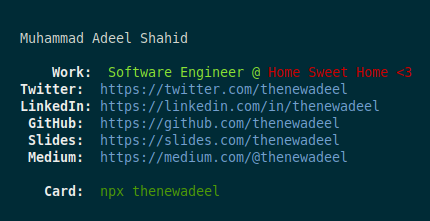

# [thenewadeel](https://www.npmjs.com/package/thenewadeel)

<center></center>

Having your own npm package is fun.

Created a [business card](https://www.npmjs.com/package/thenewadeel) forked from [Ahsan Ayyaz](https://www.npmjs.com/package/ahsanayaz) who was inspired by [bitandbang](https://twitter.com/bitandbang)'s idea he [shared on twitter](https://twitter.com/bitandbang/status/1075473070368919552).


Run below from your terminal.
```bash
npx thenewadeel
```
